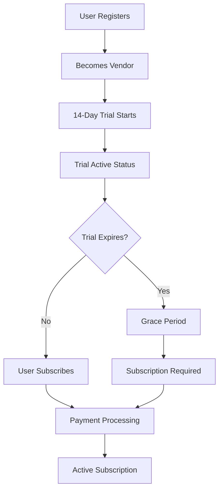
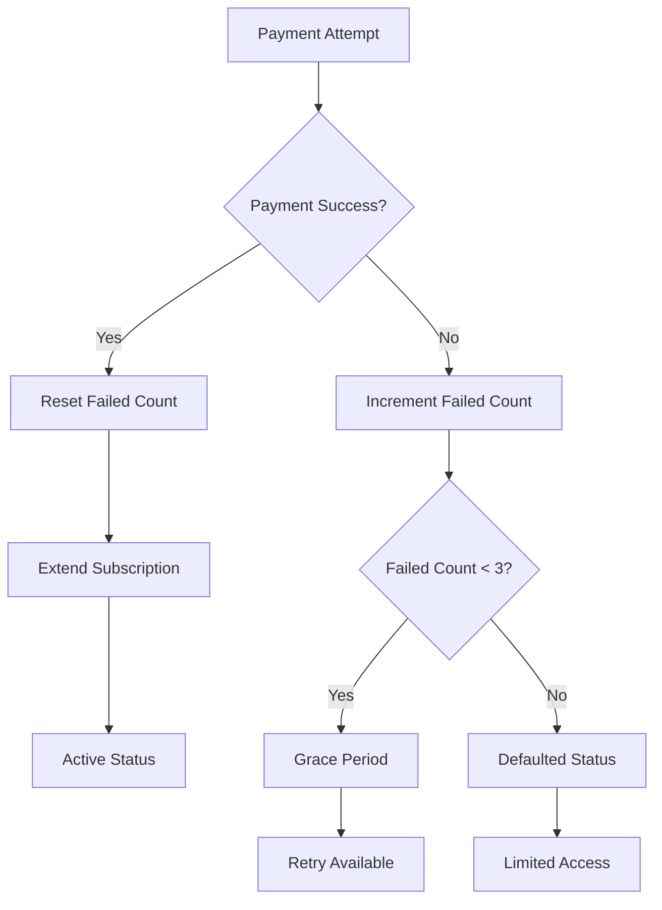
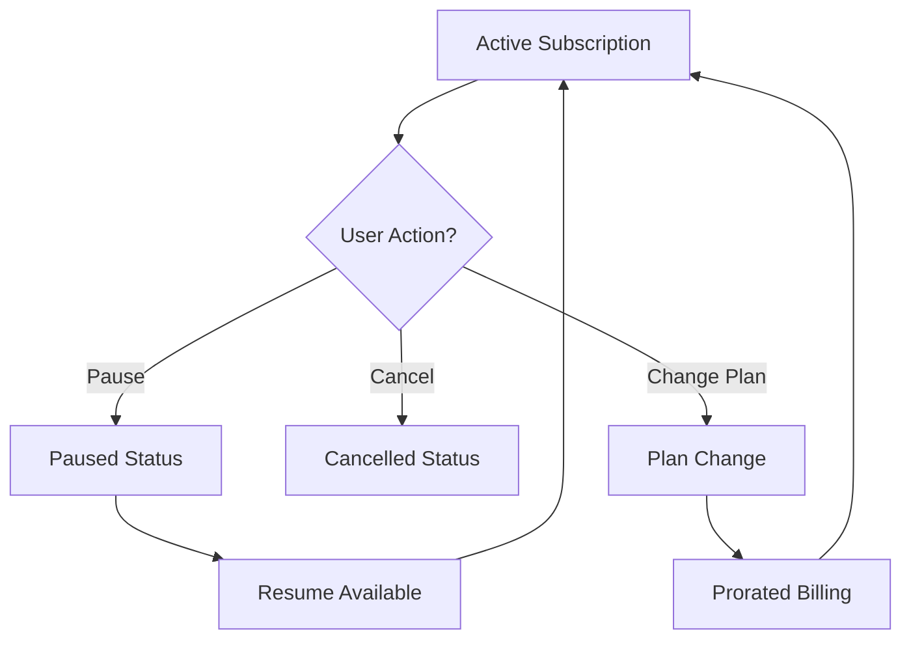

# 📚 VendorXpert Subscription System - Complete API Documentation

## 🏗️ **Architecture Overview**

The VendorXpert subscription system is a comprehensive SaaS billing solution built on Django REST Framework with Paystack integration. It supports trial periods, multiple subscription plans, payment failure handling, subscription management, and detailed analytics.

---

## 📊 **Database Models**

### **VendorPlan Model**

```python
class VendorPlan(models.Model):
    BASIC = "basic"
    PREMIUM = "premium"
    EXTERNAL = "external"

    name = CharField(max_length=50, choices=PLAN_CHOICES, unique=True)
    description = TextField(blank=True)
    price = IntegerField(help_text="Monthly price in NGN")
    max_products = IntegerField(help_text="Max number of products allowed")
    paystack_plan_code = CharField(max_length=100, blank=True)
    is_active = BooleanField(default=True)
```

### **VendorProfile Model (Subscription Fields)**

```python
class VendorProfile(models.Model):
    # Core subscription fields
    plan = ForeignKey(VendorPlan, on_delete=models.SET_NULL, null=True)
    subscription_start = DateTimeField(auto_now_add=True)
    subscription_expiry = DateTimeField(null=True, blank=True)
    subscription_status = CharField(max_length=50, choices=STATUS_CHOICES, default="trial")
    last_payment_date = DateTimeField(null=True, blank=True)

    # Trial management
    trial_start = DateTimeField(null=True, blank=True)
    trial_end = DateTimeField(null=True, blank=True)

    # Pause functionality
    pause_reason = CharField(max_length=255, blank=True, null=True)
    paused_at = DateTimeField(null=True, blank=True)

    # Payment failure tracking
    failed_payment_count = PositiveIntegerField(default=0)

    # Paystack integration
    paystack_subscription_code = CharField(max_length=100, blank=True, null=True)
    subscription_token = CharField(max_length=255, blank=True, null=True)
    pending_ref = CharField(max_length=50, blank=True, null=True)
```

### **Subscription Status Choices**

| Status      | Description               | User Access    | Payment Required |
| ----------- | ------------------------- | -------------- | ---------------- |
| `trial`     | Free trial period         | Full access    | No               |
| `active`    | Paid subscription         | Full access    | No (paid)        |
| `grace`     | Grace period after expiry | Full access    | Yes              |
| `paused`    | Temporarily paused        | Full access    | No               |
| `defaulted` | Multiple payment failures | Limited access | Yes              |
| `cancelled` | User cancelled            | No access      | No               |
| `expired`   | Subscription expired      | No access      | Yes              |

### **SubscriptionHistory Model**

```python
class SubscriptionHistory(models.Model):
    EVENT_TYPES = (
        ("subscription_created", "Subscription Created"),
        ("plan_upgraded", "Plan Upgraded"),
        ("plan_downgraded", "Plan Downgraded"),
        ("payment_success", "Payment Successful"),
        ("payment_failed", "Payment Failed"),
        ("subscription_renewed", "Subscription Renewed"),
        ("subscription_paused", "Subscription Paused"),
        ("subscription_resumed", "Subscription Resumed"),
        ("subscription_cancelled", "Subscription Cancelled"),
        ("trial_started", "Trial Started"),
        ("trial_ended", "Trial Ended"),
        ("grace_period_started", "Grace Period Started"),
        ("subscription_expired", "Subscription Expired"),
    )

    vendor = ForeignKey(VendorProfile, on_delete=CASCADE)
    event_type = CharField(max_length=50, choices=EVENT_TYPES)
    previous_plan = ForeignKey(VendorPlan, null=True, blank=True)
    new_plan = ForeignKey(VendorPlan, null=True, blank=True)
    previous_status = CharField(max_length=50, blank=True)
    new_status = CharField(max_length=50, blank=True)
    amount = DecimalField(max_digits=10, decimal_places=2, null=True, blank=True)
    payment_reference = CharField(max_length=100, blank=True)
    paystack_response = JSONField(null=True, blank=True)
    notes = TextField(blank=True)
    created_at = DateTimeField(auto_now_add=True)
```

---

## 🔧 **Core Methods**

### **VendorProfile Subscription Methods**

#### `is_subscription_active() -> bool`

```python
def is_subscription_active(self):
    """Check if subscription provides active access"""
    if self.subscription_status == "cancelled":
        return False

    if self.subscription_status == "trial":
        if self.trial_end:
            return timezone.now() <= self.trial_end
        return True  # Unlimited trial if no end date set

    if self.subscription_status == "paused":
        return True  # Paused subscriptions maintain access

    if not self.subscription_expiry:
        return self.subscription_status == "active"

    now = timezone.now()
    # Active period or grace period (7 days after expiry)
    return (
        self.subscription_status in ["active", "grace"] and
        (now <= self.subscription_expiry or
         now <= self.subscription_expiry + timedelta(days=7))
    )
```

#### `get_subscription_days_remaining() -> int`

```python
def get_subscription_days_remaining(self):
    """Get days remaining in subscription"""
    if self.subscription_status == "trial" and self.trial_end:
        return max(0, (self.trial_end - timezone.now()).days)
    elif self.subscription_expiry:
        return max(0, (self.subscription_expiry - timezone.now()).days)
    return 0
```

#### `is_in_grace_period() -> bool`

```python
def is_in_grace_period(self):
    """Check if subscription is in grace period"""
    if not self.subscription_expiry:
        return False
    now = timezone.now()
    return (
        now > self.subscription_expiry and
        now <= self.subscription_expiry + timedelta(days=7)
    )
```

#### `start_trial(days=14) -> None`

```python
def start_trial(self, days=14):
    """Start a trial period for the vendor"""
    self.subscription_status = "trial"
    self.trial_start = timezone.now()
    self.trial_end = timezone.now() + timedelta(days=days)
    self.save()

    # Log the event
    SubscriptionHistory.log_event(
        vendor=self,
        event_type="trial_started",
        notes=f"Started {days}-day trial period"
    )
```

#### `pause_subscription(reason="") -> bool`

```python
def pause_subscription(self, reason=""):
    """Pause the subscription"""
    if self.subscription_status not in ["active", "grace"]:
        return False

    old_status = self.subscription_status
    self.subscription_status = "paused"
    self.pause_reason = reason
    self.paused_at = timezone.now()
    self.save()

    # Log the event
    SubscriptionHistory.log_event(
        vendor=self,
        event_type="subscription_paused",
        previous_status=old_status,
        new_status="paused",
        notes=reason
    )
    return True
```

#### `resume_subscription() -> bool`

```python
def resume_subscription(self):
    """Resume a paused subscription"""
    if self.subscription_status != "paused":
        return False

    self.subscription_status = "active"
    self.pause_reason = ""
    self.paused_at = None
    self.save()

    # Log the event
    SubscriptionHistory.log_event(
        vendor=self,
        event_type="subscription_resumed",
        previous_status="paused",
        new_status="active"
    )
    return True
```

#### `change_plan(new_plan, immediate=False) -> dict`

```python
def change_plan(self, new_plan, immediate=False):
    """Change subscription plan with optional prorated billing"""
    if not new_plan or new_plan == self.plan:
        return False

    old_plan = self.plan
    is_upgrade = new_plan.price > (old_plan.price if old_plan else 0)

    # Calculate prorated amount if changing mid-cycle
    prorated_amount = 0
    if self.subscription_expiry and not immediate:
        days_remaining = self.get_subscription_days_remaining()
        if days_remaining > 0:
            daily_old_rate = (old_plan.price if old_plan else 0) / 30
            daily_new_rate = new_plan.price / 30
            prorated_amount = (daily_new_rate - daily_old_rate) * days_remaining

    # Update plan
    self.plan = new_plan
    self.save()

    # Log the event
    event_type = "plan_upgraded" if is_upgrade else "plan_downgraded"
    SubscriptionHistory.log_event(
        vendor=self,
        event_type=event_type,
        previous_plan=old_plan,
        new_plan=new_plan,
        amount=prorated_amount,
        notes=f"Plan changed from {old_plan.name if old_plan else 'None'} to {new_plan.name}"
    )

    return {
        "success": True,
        "prorated_amount": prorated_amount,
        "is_upgrade": is_upgrade,
        "old_plan": old_plan.name if old_plan else None,
        "new_plan": new_plan.name
    }
```

#### `extend_subscription(days=30) -> None`

```python
def extend_subscription(self, days=30):
    """Extend subscription by specified days"""
    if self.subscription_expiry:
        # If subscription is still active, extend from expiry date
        if timezone.now() <= self.subscription_expiry:
            self.subscription_expiry += timedelta(days=days)
        else:
            # If expired, extend from now
            self.subscription_expiry = timezone.now() + timedelta(days=days)
    else:
        # No expiry set, create one
        self.subscription_expiry = timezone.now() + timedelta(days=days)

    self.subscription_status = "active"
    self.last_payment_date = timezone.now()
    self.failed_payment_count = 0  # Reset failed payment count
    self.save()

    # Log the event
    SubscriptionHistory.log_event(
        vendor=self,
        event_type="subscription_renewed",
        notes=f"Subscription extended by {days} days"
    )
```

---

## 🌐 **API Endpoints**

### **Base URL**: `/userprofile/api/`

---

### **1. List Available Plans**

```http
GET /vendor-plans/
```

**Description**: Get all available subscription plans.

**Authentication**: None required

**Response**:

```json
[
  {
    "id": 1,
    "name": "basic",
    "description": "Starter plan for small vendors",
    "price": 2500,
    "max_products": 6,
    "paystack_plan_code": "PLN_basic_2500",
    "is_active": true
  },
  {
    "id": 2,
    "name": "premium",
    "description": "Growing business plan",
    "price": 3500,
    "max_products": 15,
    "paystack_plan_code": "PLN_premium_3500",
    "is_active": true
  },
  {
    "id": 3,
    "name": "external",
    "description": "Enterprise plan for large vendors",
    "price": 5000,
    "max_products": 50,
    "paystack_plan_code": "PLN_external_5000",
    "is_active": true
  }
]
```

---

### **2. Get Subscription Status**

```http
GET /my-subscription/
```

**Description**: Get comprehensive subscription information for the authenticated vendor.

**Authentication**: Bearer Token (Vendor required)

**Response**:

```json
{
  "is_vendor": true,
  "subscription_status": "trial",
  "subscription_start": "2025-10-11T10:00:00.000Z",
  "subscription_expiry": null,
  "is_active": true,
  "days_remaining": 12,
  "in_grace_period": false,
  "plan": {
    "id": 1,
    "name": "basic",
    "price": 2500.0,
    "max_products": 6
  },
  "product_usage": {
    "current_count": 3,
    "max_allowed": 6,
    "remaining": 3
  }
}
```

---

### **3. Initialize/Renew Subscription**

```http
POST /resubscribe/
```

**Description**: Start a new subscription or renew/upgrade existing subscription.

**Authentication**: Bearer Token (Vendor required)

**Request Body**:

```json
{
  "plan_id": 2
}
```

**Response (Free Plans)**:

```json
{
  "message": "Successfully subscribed to free plan",
  "plan": "basic",
  "expiry": "2025-11-10T10:00:00.000Z"
}
```

**Response (Paid Plans)**:

```json
{
  "authorization_url": "https://checkout.paystack.com/...",
  "access_code": "access_code_here",
  "reference": "payment_reference_here"
}
```

**Error Responses**:

```json
// 400 Bad Request
{
  "error": "Invalid or inactive plan."
}

// 403 Forbidden
{
  "error": "User is not a vendor."
}
```

---

### **4. Pause Subscription**

```http
POST /pause_subscription/
```

**Description**: Temporarily pause the vendor's subscription while maintaining access.

**Authentication**: Bearer Token (Vendor required)

**Request Body**:

```json
{
  "reason": "Going on vacation for 2 months"
}
```

**Response**:

```json
{
  "message": "Subscription paused successfully.",
  "status": "paused",
  "reason": "Going on vacation for 2 months"
}
```

**Error Responses**:

```json
// 400 Bad Request
{
  "error": "Cannot pause subscription. Current status: cancelled"
}
```

---

### **5. Resume Subscription**

```http
POST /resume_subscription/
```

**Description**: Resume a paused subscription and return to active status.

**Authentication**: Bearer Token (Vendor required)

**Response**:

```json
{
  "message": "Subscription resumed successfully.",
  "status": "active"
}
```

**Error Responses**:

```json
// 400 Bad Request
{
  "error": "Cannot resume subscription. Current status: active"
}
```

---

### **6. Change Subscription Plan**

```http
POST /change_plan/
```

**Description**: Upgrade or downgrade subscription plan with prorated billing.

**Authentication**: Bearer Token (Vendor required)

**Request Body**:

```json
{
  "plan_id": 3,
  "immediate": false
}
```

**Parameters**:

- `plan_id` (required): ID of the new plan to switch to
- `immediate` (optional): Whether to apply change immediately (true) or at next billing cycle (false)

**Response**:

```json
{
  "message": "Plan upgraded successfully.",
  "old_plan": "basic",
  "new_plan": "premium",
  "prorated_amount": 833.33,
  "is_upgrade": true
}
```

**Error Responses**:

```json
// 404 Not Found
{
  "error": "Plan not found or inactive."
}

// 400 Bad Request
{
  "error": "Failed to change plan. You may already be on this plan."
}
```

---

### **7. Cancel Subscription**

```http
POST /cancel_subscription/
```

**Description**: Cancel the vendor's active subscription.

**Authentication**: Bearer Token (Vendor required)

**Response**:

```json
{
  "message": "Subscription cancelled successfully."
}
```

**Error Responses**:

```json
// 400 Bad Request
{
  "message": "Subscription already cancelled."
}

// 502 Bad Gateway
{
  "error": "Failed to cancel subscription on Paystack"
}
```

---

### **8. Get Subscription History**

```http
GET /subscription_history/
```

**Description**: Get detailed history of all subscription events for the vendor.

**Authentication**: Bearer Token (Vendor required)

**Query Parameters**:

- `page` (optional): Page number for pagination

**Response**:

```json
{
  "count": 15,
  "next": "http://localhost:8000/userprofile/api/subscription_history/?page=2",
  "previous": null,
  "results": [
    {
      "id": 1,
      "event_type": "trial_started",
      "event_display": "Trial Started",
      "vendor_name": "My Store",
      "previous_plan_name": null,
      "new_plan_name": "basic",
      "previous_status": "",
      "new_status": "trial",
      "amount": null,
      "payment_reference": "",
      "notes": "14-day trial period started on vendor registration",
      "created_at": "2025-10-11T10:00:00.000Z"
    },
    {
      "id": 2,
      "event_type": "payment_success",
      "event_display": "Payment Successful",
      "vendor_name": "My Store",
      "previous_plan_name": null,
      "new_plan_name": null,
      "previous_status": "trial",
      "new_status": "active",
      "amount": 2500.0,
      "payment_reference": "TXN_123456789",
      "notes": "Payment successful, subscription renewed until 2025-11-10",
      "created_at": "2025-10-25T10:00:00.000Z"
    }
  ]
}
```

---

### **9. Get Vendor KPIs (Enhanced with Subscription Analytics)**

```http
GET /vendor-kpis/
```

**Description**: Get comprehensive KPIs including subscription analytics.

**Authentication**: Bearer Token (Vendor required)

**Response**:

```json
{
  "vendor_id": 1,
  "store_name": "My Store",
  "ratings": {
    "average_rating": 4.5,
    "total_reviews": 25,
    "rating_breakdown": {
      "5_star": 15,
      "4_star": 8,
      "3_star": 2,
      "2_star": 0,
      "1_star": 0
    }
  },
  "sales": {
    "total_orders": 150,
    "total_revenue": 75000.0,
    "total_products_sold": 300
  },
  "products": {
    "total_products": 12,
    "active_products": 10,
    "out_of_stock": 2,
    "low_stock": 3,
    "total_inventory": 250
  },
  "subscription": {
    "status": "active",
    "days_remaining": 15,
    "is_in_grace_period": false,
    "plan_name": "premium",
    "plan_price": 3500.0,
    "max_products": 15,
    "expires_at": "2025-11-10T10:00:00.000Z",
    "last_payment": "2025-10-11T10:00:00.000Z",
    "failed_payment_count": 0,
    "analytics": {
      "successful_payments": 3,
      "failed_payments": 1,
      "total_payments_value": 10500.0,
      "average_payment": 3500.0,
      "subscription_changes": 2,
      "trial_info": {
        "trial_started": "2025-09-27T10:00:00.000Z",
        "trial_ends": "2025-10-11T10:00:00.000Z",
        "trial_days_used": 14,
        "trial_days_remaining": 0
      }
    }
  }
}
```

---

## 🎣 **Webhook Handling**

### **Paystack Webhook Endpoint**

```http
POST /paystack_subscription_webhook/
```

**Description**: Internal webhook endpoint for Paystack payment notifications.

**Authentication**: Paystack signature verification

**Supported Events**:

#### **Successful Payment Events**

- `charge.success`
- `invoice.payment_success`

**Behavior**:

- Updates vendor subscription status to "active"
- Extends subscription by 30 days
- Resets failed payment count
- Logs payment success event

#### **Failed Payment Events**

- `charge.failed`
- `invoice.payment_failed`

**Behavior**:

- Increments failed payment count
- Sets status to "grace" (attempts 1-2) or "defaulted" (3+ attempts)
- Logs payment failure with reason

#### **Subscription Events**

- `subscription.create`
- `subscription.disable`

**Behavior**:

- Updates Paystack subscription codes
- Handles subscription cancellations
- Logs subscription state changes

---

## 🔒 **Permission System**

### **HasActiveSubscription**

```python
class HasActiveSubscription(BasePermission):
    def has_permission(self, request, view):
        user = request.user

        # Ensure user is a vendor
        if not hasattr(user, 'vendor_profile'):
            return False

        vendor = user.vendor_profile
        expiry = vendor.subscription_expiry

        if not expiry:
            return False

        now = timezone.now()

        # Check if within active period or grace period
        return expiry >= now or expiry + timedelta(days=7) >= now
```

### **VendorFeatureAccess**

```python
class VendorFeatureAccess(BasePermission):
    def has_permission(self, request, view):
        vendor = getattr(request.user, 'vendor_profile', None)
        if not vendor or not vendor.is_verified:
            return False
        return vendor.is_subscription_active()
```

### **Product Creation Limits**

```python
def can_create_product(user):
    if not hasattr(user, 'vendor_profile'):
        return False

    vendor = user.vendor_profile
    plan = vendor.plan

    if not plan or not vendor.is_subscription_active():
        return False

    if plan.max_products is None:
        return True

    current_count = vendor.product.exclude(status='deleted').count()
    return current_count < plan.max_products
```

---

## 🔄 **Subscription Lifecycle**

### **1. Vendor Registration Flow**



### **2. Payment Processing Flow**



### **3. Subscription Management Flow**



---

## ⚙️ **Configuration**

### **Environment Variables**

```bash
# Paystack Configuration
PAYSTACK_SECRET_KEY=sk_test_xxxxx
PAYSTACK_PUBLIC_KEY=pk_test_xxxxx

# Subscription Settings
DEFAULT_TRIAL_DAYS=14
GRACE_PERIOD_DAYS=7
MAX_FAILED_PAYMENTS=3
```

### **Django Settings**

```python
# Subscription-related settings
SUBSCRIPTION_SETTINGS = {
    'DEFAULT_TRIAL_DAYS': 14,
    'GRACE_PERIOD_DAYS': 7,
    'MAX_FAILED_PAYMENTS': 3,
    'AUTO_EXTEND_TRIAL': False,
    'TRIAL_REQUIRES_CARD': False,
}
```

---

## 🧪 **Testing**

### **Create Test Subscription**

```python
from userprofile.models import VendorProfile, VendorPlan

# Create test plan
plan = VendorPlan.objects.create(
    name="test",
    price=1000,
    max_products=5,
    is_active=True
)

# Start vendor trial
vendor = VendorProfile.objects.get(user__email="test@example.com")
vendor.start_trial(days=7)

# Test subscription status
print(vendor.is_subscription_active())  # True
print(vendor.get_subscription_days_remaining())  # 7
```

### **Test Plan Changes**

```python
# Change to premium plan
premium_plan = VendorPlan.objects.get(name="premium")
result = vendor.change_plan(premium_plan, immediate=True)
print(result)  # {'success': True, 'is_upgrade': True, ...}
```

### **Test Payment Simulation**

```python
# Simulate successful payment
vendor.extend_subscription(days=30)
print(vendor.subscription_status)  # 'active'

# Simulate failed payment
vendor.failed_payment_count += 1
if vendor.failed_payment_count >= 3:
    vendor.subscription_status = "defaulted"
vendor.save()
```

---

## 📈 **Analytics & Reporting**

### **Subscription Metrics Available**

- Total active subscriptions by plan
- Trial conversion rates
- Average revenue per user (ARPU)
- Payment failure rates
- Plan change frequency
- Subscription lifetime value

### **Event Tracking**

All subscription events are logged in `SubscriptionHistory` with:

- Event type and timestamp
- Plan changes with amounts
- Payment references and responses
- Status transitions
- Custom notes and metadata

---

## 🚨 **Error Handling**

### **Common Error Codes**

| Code | Description             | Resolution                     |
| ---- | ----------------------- | ------------------------------ |
| 400  | Invalid request data    | Check request body format      |
| 401  | Authentication required | Provide valid Bearer token     |
| 403  | Permission denied       | Ensure user is verified vendor |
| 404  | Resource not found      | Check plan/vendor exists       |
| 502  | Paystack API error      | Check Paystack configuration   |

### **Subscription-Specific Errors**

- **Trial Already Active**: User already in trial period
- **Plan Limit Reached**: Cannot create more products
- **Payment Required**: Subscription expired, payment needed
- **Invalid Status Change**: Cannot pause cancelled subscription

---

## 🛡️ **Security Considerations**

### **Webhook Security**

- Paystack signature verification required
- Request body validation
- Idempotency handling for duplicate events

### **API Security**

- JWT token authentication
- Permission-based access control
- Rate limiting on subscription endpoints
- Input validation and sanitization

### **Data Privacy**

- Payment data stored securely
- PCI compliance considerations
- Subscription history audit trail
- GDPR compliance for user data

---

## 📞 **Support & Troubleshooting**

### **Common Issues**

**Q: Vendor can't create products after trial expires**
A: Check subscription status - may need payment or plan renewal

**Q: Payments not updating subscription status**
A: Verify webhook configuration and Paystack integration

**Q: Trial period not starting for new vendors**
A: Check VendorRegisterSerializer trial initialization

**Q: Plan changes not calculating prorated amounts**
A: Verify subscription_expiry and plan pricing data

### **Debug Commands**

```python
# Check vendor subscription status
vendor = VendorProfile.objects.get(user__email="user@example.com")
print(f"Status: {vendor.subscription_status}")
print(f"Active: {vendor.is_subscription_active()}")
print(f"Days remaining: {vendor.get_subscription_days_remaining()}")

# Check subscription history
history = vendor.subscription_history.all()[:5]
for event in history:
    print(f"{event.created_at}: {event.event_type} - {event.notes}")

# Check plan limits
if vendor.plan:
    current_products = vendor.product.exclude(status='deleted').count()
    print(f"Products: {current_products}/{vendor.plan.max_products}")
```

---

## 🔄 **Migration Guide**

### **Upgrading from Basic Subscription**

1. Apply migration: `python manage.py migrate userprofile`
2. Update API clients to handle new status values
3. Configure webhook handlers for new events
4. Test trial and pause/resume functionality
5. Update frontend to display enhanced subscription info

### **Backward Compatibility**

- All existing subscriptions remain functional
- New fields default to appropriate values
- Legacy API responses include new fields with defaults
- Existing Paystack integrations continue working

---

This documentation covers the complete VendorXpert subscription system. For additional technical details, refer to the source code in `userprofile/models.py`, `userprofile/api_views.py`, and `userprofile/serializers.py`.
